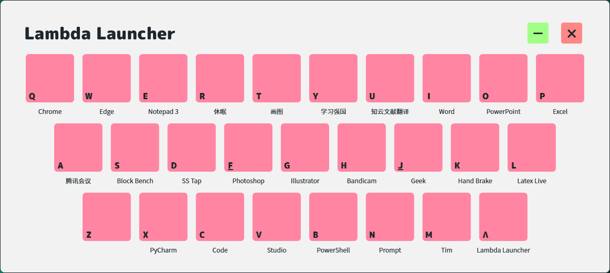
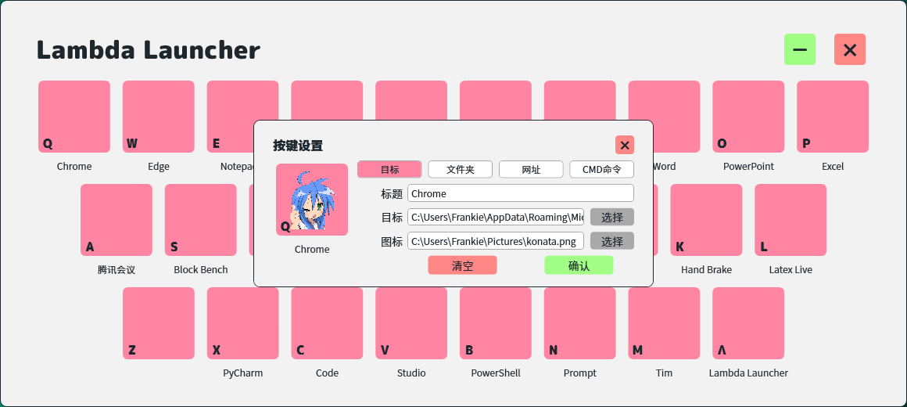
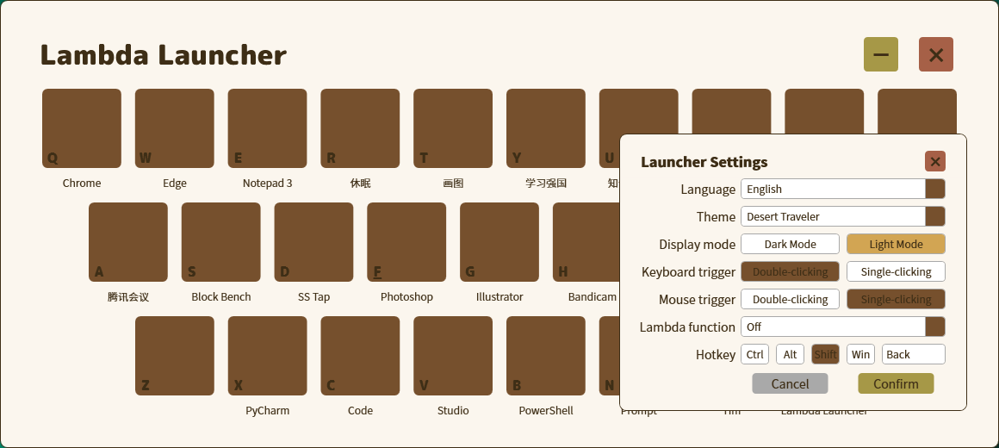
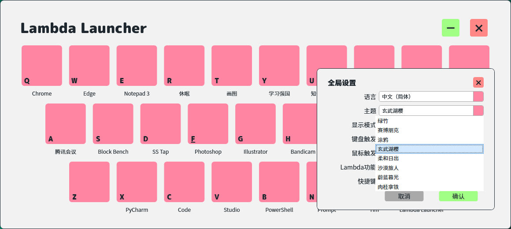
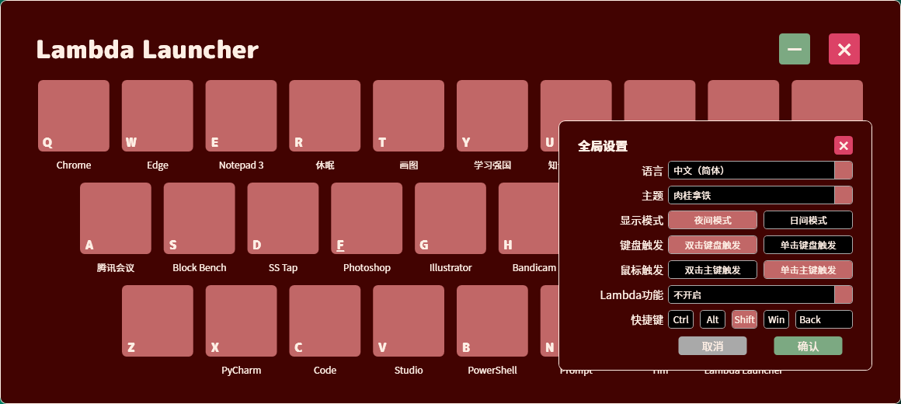

# Lambda Launcher

Lambda Launcher is a WPF application inspired by MaxLauncher, and is dedicated to bringing users an easy-to-use launcher with a modern interface and just the right functionality.

## Features

- Use your keyboard and mouse to quickly open an application with one click! And if you're worried about misuse, you can customize it to open with a "double click" - for keyboard and mouse!
- Modern and minimalist design! Multi-color theme switching. Coming soon (maybe the "soon" will be longer) with customizable color themes for the app.
- Light Mode and Dark Mode! Interchangeable foreground and background colors, more friendly to your eyes.
- Internationalization - **i18n**! Currently supports Chinese (both simplified and traditional), English and Japanese. Note: Including this document, there are more machine translation in the non-Chinese part, please pr if there is any oversight.
- Native development! No need to use Electron - no more installing another Chrome on your computer, use WPF to make an elegant and modern interface.
- Apps/files, folders, websites or cmd commands! A more freely configurable Key Setting solution!
- Hotkey! Nobody doesn't like to set and use the hotkeys they're used to!

## Screenshots

### Main Window

### Key Settings

### Multi-Language

### 8 Well-Designed Themes

### Dark Mode

## Developer

Me myself.

## Acknowledgements

- My girlfriend. She is one of my aesthetic directors.
- @HAmazon59. He is the first person to starred this project.
- Smashicons. Whose image is used to show that the icon doesn't exist.
- ColorHexa, which I use as a color matching tool.
- ChatGPT. Although it is not too smart, it has helped me a lot.
